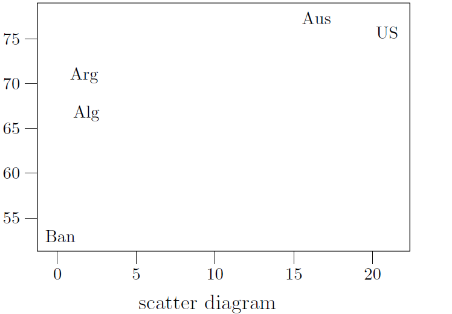
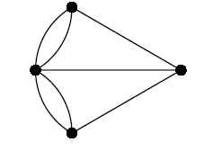

# metapost
Exercise about graphic programming - metapost

### Usage

````
cd pic
mpost -tex=latex figure.mp
cd ..
latex metapost.tex
dvipdfm metapost.dvi

````

### Examples

* scatter diagram



* geometric figure


